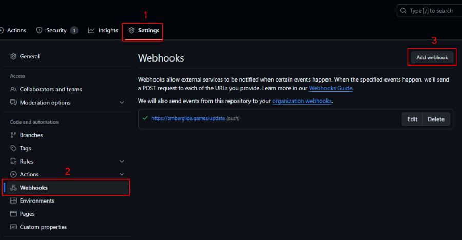

Title: Git Automation!
Description: A short post on git, webhooks and automation.
Date: 2024-04-21 18:22
Tags: git, automation, webhooks

This is a short post on git, webhooks and automation to automatically update a blag page when 
a new post is committed to a GitHub repository.

### Setting up a webhook

First, you need to set up a webhook in your GitHub repository. Go to the repository settings, 
then to the "Webhooks" section. Click on "Add webhook" and enter the URL where you want to receive notifications and 
ensure to set a valid secret.

 
{: .responsive }

Additional Text
